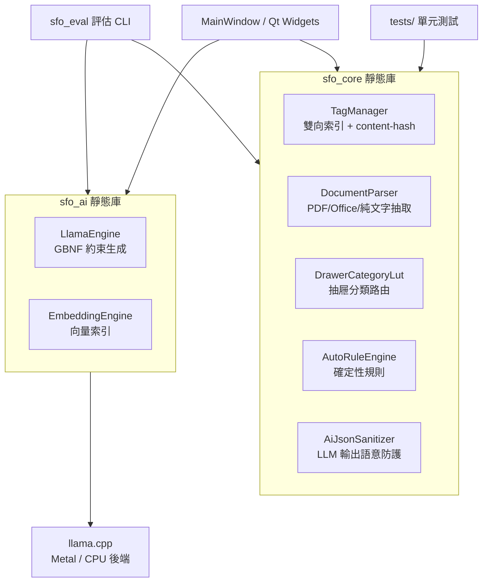

# 📂 SmartFile Organizer (智慧檔案管理系統)


SmartFile Organizer 是一款 **隱私優先（100% 本地運算）** 的 AI 檔案管理桌面工具。內建本地 LLM 與 embedding 模型，自動解析檔案語意、生成摘要與標籤、提供全工作區向量語意搜尋與自動歸檔——**您的檔案內容永遠不會離開這台電腦**。

## 🔒 核心主張：隱私優先的本地 AI

- 所有 AI 推論（標籤生成、摘要、語意搜尋）皆在本機 CPU/GPU 上執行
- 程式碼層面可驗證：除「首次模型下載」外，**全程式零網路呼叫**
- 無帳號、無訂閱、無遙測——離線環境可完整使用

## 📊 量化評估（合成基準語料，100 檔 / 10 類別）

| 指標 | 數值 |
|---|---|
| 抽屜分類正確率 | **86.0%** |
| LLM 原始輸出 JSON 合法率 | **100%**（GBNF 約束解碼） |
| 平均單檔分析時間 | ~10–20 秒（Apple M4） |
| 峰值記憶體 | ~5.8 GB |

> 重現方式：`./build/sfo_eval --generate /tmp/corpus && ./build/sfo_eval --run /tmp/corpus --model <model.gguf>`，報告輸出於 `corpus/eval_report.md`。框架同時支援匯入人工標註的真實檔案語料（編輯 `manifest.json` 即可）。

## ✨ 主要功能

* **🧠 本地 AI 語意引擎** — llama.cpp + GBNF 約束解碼（語法錯誤的 JSON 物理上不可能出現），LUT 抽屜分類路由，使用者糾錯紀錄會以 few-shot 形式回饋給後續分析
* **🔎 向量語意搜尋** — 專用 embedding 模型（BGE-M3）對全工作區建立向量索引，自然語言搜尋不限檔案數量，索引持久化、跨次啟動累積
* **🗂️ 自動規則引擎** — 確定性整理規則（資料夾／副檔名／檔名 → 加標籤／歸檔），套用前必先預覽
* **🛡️ 資料安全** — 實體歸檔具備交易日誌（當機可復原）、10 層復原堆疊；檔案在外部被改名／搬移時以 content-hash 自動重新接回標籤
* **🗑️ 重複檔案掃描** — 獨立全工作區掃描（先比大小再比 SHA-256），不需先執行 AI 分析
* **⚡ 體驗細節** — 批次分析 ETA 預估、暫停／恢復、電池供電自動暫停（可選）、低信心結果標示、簡易模式與新手引導、繁中／英文雙語介面

## 🛠️ 技術堆疊

* **GUI**: Qt 6 (Widgets)
* **語言**: C++20
* **AI**: llama.cpp（GGUF；聊天模型 + embedding 模型）
* **持久化**: JSON metadata + QSettings + 二進位向量索引
* **測試**: Qt Test（5 個測試套件），GitHub Actions CI（macOS + Windows）

## 🏗️ 架構



## 💻 系統需求

| | 最低 | 建議 |
|---|---|---|
| RAM | 8 GB（模型載入後峰值約 6 GB） | 16 GB |
| 硬碟 | 5 GB（模型檔） | 8 GB |
| macOS | Apple Silicon（Metal 加速） | M 系列晶片 |
| Windows | x64、AVX2 CPU | 具獨立 GPU 更佳 |

低於 4 GB RAM 時程式會於啟動時警告；推論可能極慢或失敗。

## 🚀 快速啟動

```bash
git clone https://github.com/Lutgam/SmartFileOrganizer.git
cd SmartFileOrganizer
cmake -B build -DCMAKE_BUILD_TYPE=Release
cmake --build build --parallel
./build/SmartFileOrganizer
```

1. 首次啟動若無模型，會引導您**一鍵下載建議模型**（Qwen2.5-3B + BGE-M3，含進度與完整性驗證）；也可在設定中手動指定任何 `.gguf`。
2. 選擇工作區資料夾 → 點「開始 AI 智能分析」。
3. 跑單元測試：`ctest --test-dir build --output-on-failure`

## 📁 專案結構

```
src/core/   TagManager、DocumentParser、分類 LUT、規則引擎（純邏輯、可測試）
src/ai/     LlamaEngine（LLM）、EmbeddingEngine（向量）、輸出防護層
src/gui/    MainWindow、設定、模型下載器、規則管理、關聯圖譜
tests/      Qt Test 單元測試（CI 自動執行）
tools/      sfo_eval 量化評估 CLI
```

## 授權條款 (License)

本專案採用 **PolyForm Noncommercial License 1.0.0** 授權。

您可以免費將本專案的原始碼用於**個人、學術研究、教育及非營利目的**。
**嚴禁任何未經授權的商業使用**（包含但不限於：整合至商業軟體、企業內部業務使用、作為付費服務的一部分提供等）。

詳細的授權條款，請參閱本專案根目錄下的 [LICENSE](LICENSE.md) 檔案。
